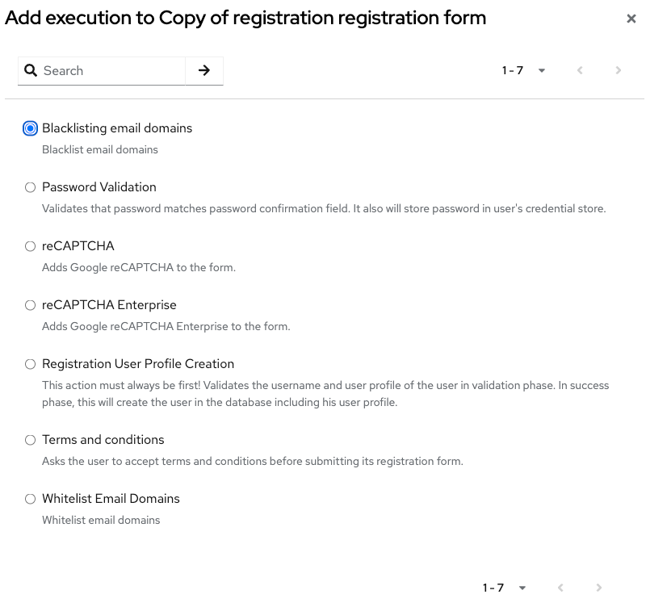
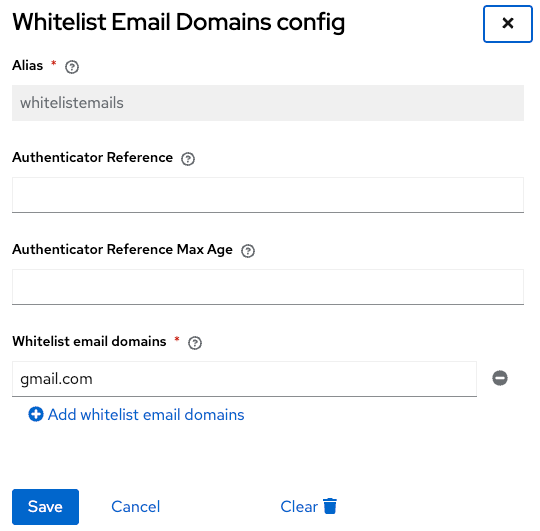

# Filter email domain registration

This FormAction filter (blacklist or whitelist) email domains based on a registrated list.

## Build

This project uses Maven, needs at least JDK 2x1 (openjdk).

```
mvn clean install
```

## Deploy

Copy generated jar file from "deployments" directory to "providers" directory in Keycloak

## Usage

From your registration flow, add a new execution in the "registration form" : 



Then, configure the list : 


